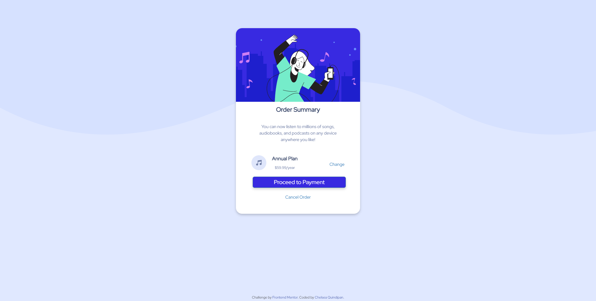

# Frontend Mentor - Order summary card solution

This is a solution to the [Order summary card challenge on Frontend Mentor](https://www.frontendmentor.io/challenges/order-summary-component-QlPmajDUj). Frontend Mentor challenges help you improve your coding skills by building realistic projects. 

## Table of contents

- [Overview](#overview)
  - [The challenge](#the-challenge)
  - [Screenshot](#screenshot)
  - [Links](#links)
- [My process](#my-process)
  - [Built with](#built-with)
  - [What I learned](#what-i-learned)
  - [Continued development](#continued-development)
  - [Useful resources](#useful-resources)
- [Author](#author)


## Overview

### The challenge

Users should be able to:

- See hover states for interactive elements

### Screenshot

 

### Links

- Solution URL: [Add solution URL here](https://your-solution-url.com)
- Live Site URL: [Add live site URL here](https://your-live-site-url.com)

## My process

### Built with

- HTML
- CSS
- Bootstrap

### What I learned

I learned how to use Bootstrap into my HTML code. This helped me create a card easily. I also learned how to change the look of buttons.

```html
<div class="card text-center" style="width: 40rem; height: 60rem;">
  
  <div class="card-body">
    <h4 class="card-title">Order Summary</h4>
    <p class="card-text">
      You can now listen to millions of songs,<br>audiobooks, and podcasts on any device<br>anywhere you like! </p>
    <div class="plan"> 
      <div class="music"></div>
        <div class="media-body-2"><div class="media-body"><p>Annual Plan</p></div><p>$59.99/year</p></div>
        <div class="change"><a href="#">Change</a></div>
    </div> 
    <a href="#" class="btn btn-primary btn-lg btn-block">Proceed to Payment</a>
    <br>
    <a href="#">Cancel Order</a> </p>
  </div>
</div>
```
```css
.btn {
  background-color: hsl(245, 75%, 52%);
  box-shadow: 0 4px 8px 0 rgba(0, 0, 0, 0.2);
  padding: 5px 5px 5px 5px;
  max-width: 75%;
  margin-left: 3em;
}
.btn:hover {
  background-color: hsl(223, 47%, 23%);
  box-shadow: 0 4px 8px 0 rgba(0, 0, 0, 0.2);
}
```


### Continued development

I want to implement my skills to keep learning more about front-end programming languages. This is one of the first webpages I have created and I am quite proud of how much I was able to achieve and make it look like the picture.

### Useful resources

- [Bootstrap Documentation](https://getbootstrap.com/docs/4.0/getting-started/introduction/) - This helped me with learning about Bootstrap. 
- [W3 Schools](https://www.w3schools.com/) - This helped me when I got stuck.


## Author

- Website - [Chelsea Quindipan](https://chelseaquindipan.ca/)
- LinkedIn - [Chelsea Quindipan](https://www.linkedin.com/in/chelsea-quindipan/)
- Frontend Mentor - [@quindipc](https://www.frontendmentor.io/profile/quindipc)
- Github - [@quindipc](https://github.com/quindipc)


